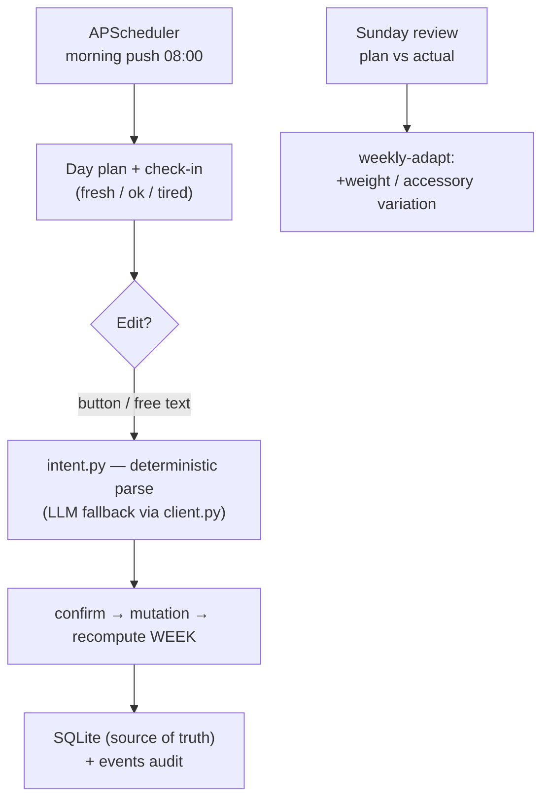

# Beach Volley Coach 🏐


Personal AI training coach in Telegram, built around **beach volleyball as the top
priority** — gym, nutrition and recovery are auto-scheduled around it. Morning push
with the day's plan, edits straight from the chat (buttons or free text), automatic
weekly recalculation.

> ⚠️ The athlete profile in this repo (`docs/profile.md`, `bot/modules/profile_seed.py`)
> is a **generic sample** for demonstration. Put your own data in there before first run.

## ✨ Highlights
- **Priority-driven scheduler** — a rule engine keeps volleyball first: heavy legs never
  land on a game day or the day before; a "tired" check-in automatically lightens the gym.
- **Edit-from-chat flow** — buttons *and* free text; a deterministic intent parser
  (`bot/intent.py`) handles the common edits at zero LLM cost, LLM only as fallback.
- **Pluggable LLM brain** — everything sits behind `bot/llm/client.py`; switching from
  free Gemini to paid Claude/OpenAI is one branch in `build_llm()`, no bot-code changes.
- **Deterministic content** — exercises, progression, nutrition targets (Mifflin×1.75)
  computed in code, not by the LLM — cheap, stable, testable.
- **Adaptive week** — Sunday review (plan vs actual) auto-adjusts next week's working
  weights and accessory variation.

## How it works


## Stack
Python 3.11 · **aiogram 3** (long-polling) · **APScheduler** · **SQLite** ·
pluggable LLM (Google Gemini free tier by default) · **Docker Compose** · deployed on a VPS.

## Modules
- `handlers/` · `mutations.py` · `intent.py` — chat flow, edits, deterministic parsing
- `modules/schedule_sync.py` · `weekly_adapt.py` — week generation & adaptive progression
- `content/` — workouts, exercises, glossary (prehab-aware)
- `nutrition/` — calorie/macro targets, food base, logging
- `llm/` — provider-agnostic client (`gemini.py` + swap point)

## Setup (keys — all free tier)
1. **Bot token:** message [@BotFather](https://t.me/BotFather) → `/newbot` → copy the token.
2. **Gemini key (free):** https://aistudio.google.com/app/apikey → create a key.
3. Copy `.env.example` → `.env`, fill `TELEGRAM_BOT_TOKEN` and `GEMINI_API_KEY`.
4. Start the bot, send `/start` — it replies with your `chat_id`. Put it in `.env` as
   `TELEGRAM_CHAT_ID` and restart (needed for the morning push).

## Run locally
```bash
python -m venv .venv
.venv/Scripts/python -m pip install -r requirements.txt   # Windows
# source .venv/bin/activate && pip install -r requirements.txt   # Linux/macOS
cp .env.example .env    # then fill in .env
python -m bot.main
```

## Deploy (Docker)
```bash
cp .env.example .env && nano .env     # fill tokens
docker compose up --build -d          # rebuild after any .py change
docker compose logs -f coach
```

## Swapping the LLM later
Logic is hidden behind `bot/llm/client.py` (`LLMClient`). To move to Claude/OpenAI:
add an implementation next to `gemini.py` and one branch in `build_llm()` — bot code unchanged.
